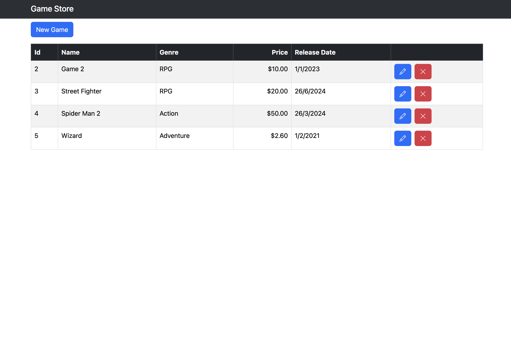

# GameStore

GameStore API is a simple yet powerful .NET project built with C# and Entity Framework Core. This project serves as a backend for a game store application, providing a set of RESTful APIs to manage and retrieve game data.

## Features

- **Entity Framework Core**: Used for data access, mapping entities to database tables, and managing relationships.
- **Database Seeding**: Predefined data for game genres is added to the database during the application startup.
- **Eager Loading**: The application uses the `.Include()` method to load related data as part of the initial query.

